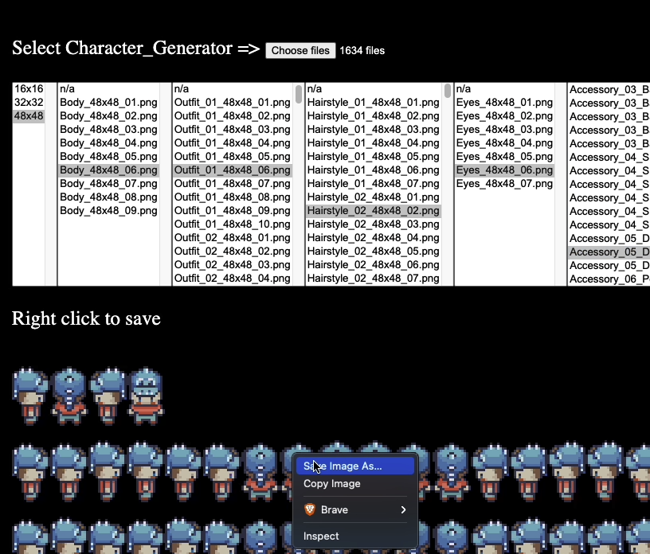

# Character Generator

A tools to generate character based on https://limezu.itch.io/moderninteriors assets

# Instructions 

1. Ensure generator.html is located in Modern_Interiors/2_Characters folder
2. Open Generator.html
3. Click Choose files to import the assets
4. Voila!

# Sample 

# Assets
- [LimeZu](https://limezu.itch.io/) 

# Credits
- Inspired by https://0a3r.itch.io/modern-interiors-character-generation-tool works, so build this tools for my machine